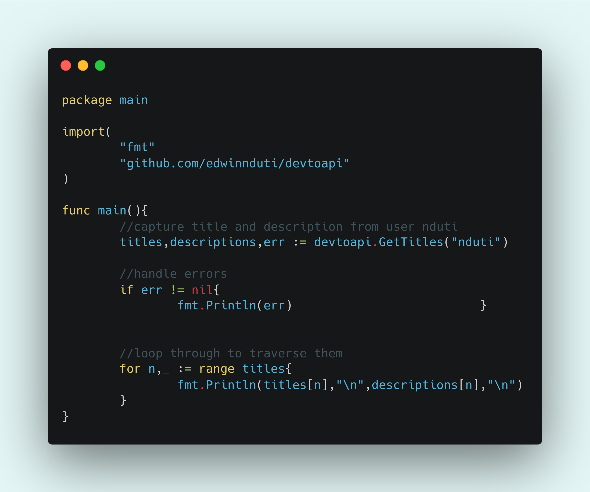

# dev.to API    [](https://codebeat.co/projects/github-com-edwinnduti-devtoapi-master)
### A consumed dev.to API using Go

* Still under construction but usable.

``` $ go get github.com/edwinnduti/devtoapi```

</img>
* just alittle more 
